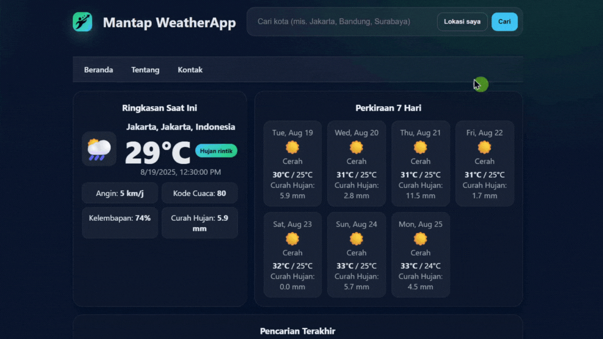

 
    
# 🌦️ Mantap WeatherApp 


by **Mantap Digital**

[](https://github.com/mantap-digital-training)
[](https://x.com/mantapdigital)
[](https://instagram.com/mantapdigital)
[](https://linkedin.com/in/mantapdigital)
[](https://youtube.com/@mantapdigital)

  


[](https://mantap-digital-training.github.io/weatherapp/)  
Aplikasi web sederhana dengan HTML, CSS, Javascript, dan API dari [Open-Meteo](https://open-meteo.com) untuk menampilkan cuaca terkini di lokasi pilihan Anda.

### Fitur:
✅ Informasi cuaca saat ini: lokasi kamu / kota yang kamu tentukan sendiri  
✅ Informasi perkiraan cuaca 7 hari kedepan  
✅ Informasi cuaca termasuk suhu, angin, kelembapan, hujan(hari ini), dan kode cuaca  
✅ Akses cepat informasi cuaca sesuai Histori Pencarian Terakhir   
✅ Tampilan sederhana dan responsif  
✅ Jalankan tanpa ribet konfigurasi  


## Persyaratan Pengguna 📦 
- **Browser** modern (Chrome, Firefox, Edge, Safari)  
- **Koneksi Internet** (Untuk ambil data dari Open-Meteo API)

## Instalasi ⚙️ 
Pastikan sudah memiliki web server / application server aktif (Apache2, Node.Js, Python 3, atau lainnya)
```bash
# Clone repository
git clone https://github.com/mantap-digital-training/weatherapp.git
```

```bash
# Go to directory
cd weatherapp
```

```bash
# Open
start index.html
```

## Struktur Direktori 📂

```plaintext
📂 weatherapp/                 # Root project folder
│
├── 📂 assets/                 # Berisi file pendukung (CSS, JS, Image)
│   ├── 📂 css/                # Styling (tampilan UI)
│   │   └── 🎨 style.css       # File utama stylesheet
│   │
│   ├── 📂 img/                # Media/Gambar untuk aplikasi
│   │   ├── 🖼️ demo.gif        # Demo aplikasi
│   │   └── 🖼️ mantaplogo.png  # Logo aplikasi
│   │
│   └── 📂 js/                 # Script JavaScript utama
│       ├── 📄 app.js          # File script utama aplikasi
│       └── 📄 include.js      # Script untuk menyertakan komponen
│
├── 📂 components/             # Kumpulan komponen HTML terpisah
│   ├── 📄 footer.html         # Komponen footer
│   ├── 📄 header.html         # Komponen header
│   └── 📄 navbar.html         # Komponen navbar (navigasi)
│
├── 📄 index.html              # Entry point aplikasi (halaman utama)
└── 📄 readme.md               # Dokumentasi project
```

## Cara Penggunaan 🚀
1. Buka index.html dengan browser
2. Masukkan nama kota atau lokasi yang diinginkan lalu klik "Cari" atau
3. Gunakan geolokasi dengan cara klik "Lokasi saya"
4. Aplikasi akan menampilkan suhu, kelembaban, angin, curah hujan, dan kode cuaca saat ini dan perkiraan 7 hari kedepan.
5. Untuk melihat informasi cuaca dari pencarian sebelumnya dengan cara klik "satu tombol kota" dari list histori pencarian terakhir

## Cuplikan Kode 📟
**Mencari Koordinat** (latitude & longitude) dan **Zona Waktu** (timezone) dari **Nama Kota** menggunakan API Geocoding Open-Meteo:

```javascript
async function geocode(name){
    const url = `https://geocoding-api.open-meteo.com/v1/search?name=${encodeURIComponent(name)}&count=1&language=id&format=json`;
    const res = await fetch(url, {headers:{'Accept':'application/json'}});
    if(!res.ok) throw new Error('Gagal geocoding');
    const data = await res.json();
    if(!data.results || !data.results.length) throw new Error('Kota tidak ditemukan');
    const r = data.results[0];
    return {
      id: r.id,
      name: r.name,
      admin1: r.admin1,
      country: r.country,
      lat: r.latitude,
      lon: r.longitude,
      tz: r.timezone
    };
  }
```
**Mengambil Data Cuaca** dari Open-Meteo Forecast API berdasarkan **Koordinat** (latitude, longitude) dan **Zona Waktu** (timezone):

```javascript
async function fetchWeather(lat, lon, tz){
    const params = new URLSearchParams({
      latitude: lat, longitude: lon,
      timezone: tz || 'auto',
      current: 'temperature_2m,relative_humidity_2m,weather_code,wind_speed_10m,wind_direction_10m',
      hourly: 'relative_humidity_2m',
      daily: 'weather_code,temperature_2m_max,temperature_2m_min,precipitation_sum'
    });
    
    const url = `https://api.open-meteo.com/v1/forecast?${params.toString()}`;
    const res = await fetch(url, {headers:{'Accept':'application/json'}});
    if(!res.ok) throw new Error('Gagal mengambil cuaca');
    const data = await res.json();

    const current = {
      time: data.current?.time || data.current_weather?.time,
      temperature: data.current?.temperature_2m ?? data.current_weather?.temperature,
      windspeed: data.current?.wind_speed_10m ?? data.current_weather?.windspeed,
      winddirection: data.current?.wind_direction_10m ?? data.current_weather?.winddirection,
      weathercode: data.current?.weather_code ?? data.current_weather?.weathercode
    };

    let humidity = data.current?.relative_humidity_2m;
    if (humidity == null && data.hourly?.relative_humidity_2m?.length){
      const idx = data.hourly.time?.indexOf(current.time);
      humidity = idx >= 0 ? data.hourly.relative_humidity_2m[idx] : data.hourly.relative_humidity_2m[0];
    }

    return { current, daily: data.daily, humidity };
  }
  ```

## Roadmap Pengembangan 🗺️ 

### ✅ Tahap 1: Dasar Aplikasi
- [x] Membuat halaman utama dengan UI modern
- [x] Navbar dengan menu **Beranda, Tentang, Kontak**
- [x] Pencarian kota (search bar + tombol "Lokasi Saya")
- [x] Ringkasan cuaca saat ini (suhu, kondisi, kelembapan, angin, curah hujan, kode cuaca)
- [x] Icon cuaca yang beragam
- [x] Perkiraan cuaca 7 hari (ikon, suhu, curah hujan)
- [x] Riwayat pencarian kota terakhir
- [x] Styling modern dengan tema gelap (dark mode default)
- [x] Deploy ke **GitHub Pages**

### 🚀 Tahap 2: Peningkatan Fitur
- [ ] Update atau refresh cuaca real-time/frekuensi tertentu
- [ ] Mode terang (Light Mode) selain dark mode
- [ ] Format tanggal otomatis sesuai dengan bahasa yang konsisten
- [ ] Tambahkan detail cuaca per jam (hourly forecast)
- [ ] Buat tampilan **responsive penuh** untuk semua ukuran layar (mobile, tablet, desktop)

### 🌟 Tahap 3: Fitur Tingkat Lanjut
- [ ] Integrasi peta interaktif (Leaflet.js / Mapbox)
- [ ] Grafik tren suhu & curah hujan mingguan (Chart.js / Recharts)
- [ ] Multi-bahasa (Indonesia, Inggris, dll.)
- [ ] Pengaturan preferensi pengguna (lokasi default, unit suhu, bahasa)
- [ ] Notifikasi cuaca ekstrem (hujan deras, badai, panas ekstrem)

## Lisensi 📜 
Proyek ini dilisensikan di bawah [MIT License](LICENSE).  
*Anda bebas menggunakan, menyalin, memodifikasi, menggabungkan, menerbitkan, dan mendistribusikan proyek ini dengan syarat tetap mencantumkan atribusi kepada **Mantap Digital**. Tidak ada jaminan yang diberikan, gunakan dengan risiko Anda sendiri.*

## Kredit 🙏
- **Open-Meteo API** → Penyedia data cuaca yang digunakan dalam aplikasi ini
- **Tim Pengembang Mantap Digital** → Terima kasih atas ide, masukan, dan kontribusinya
